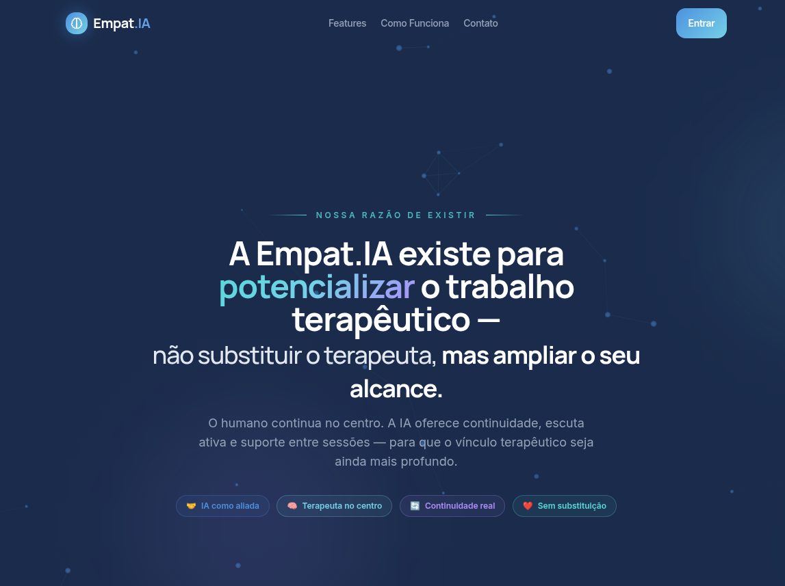
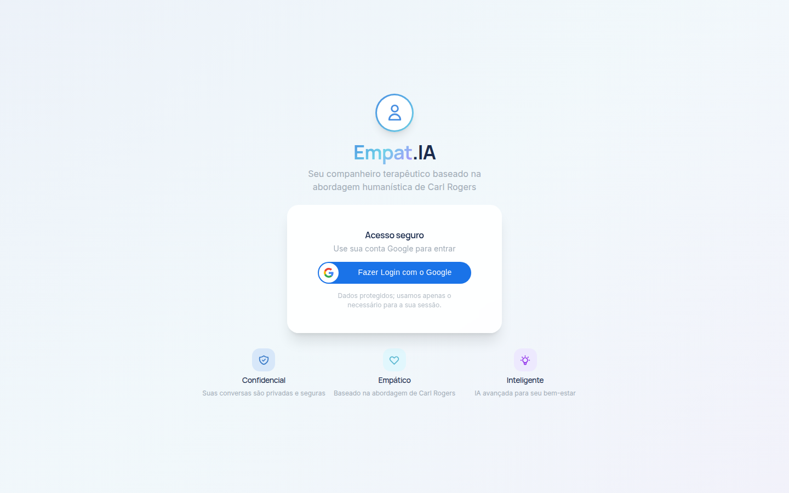
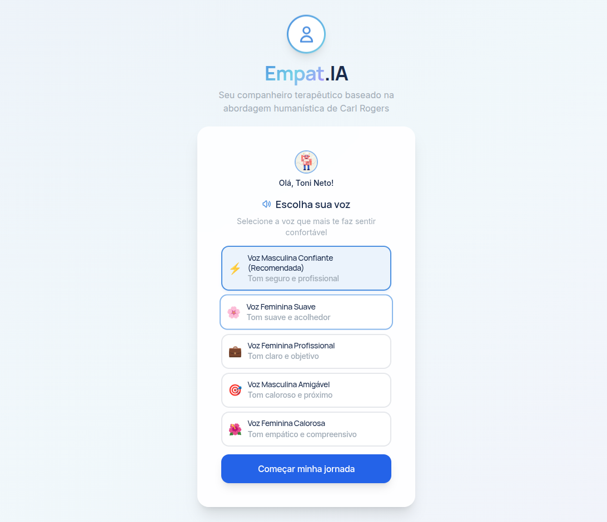
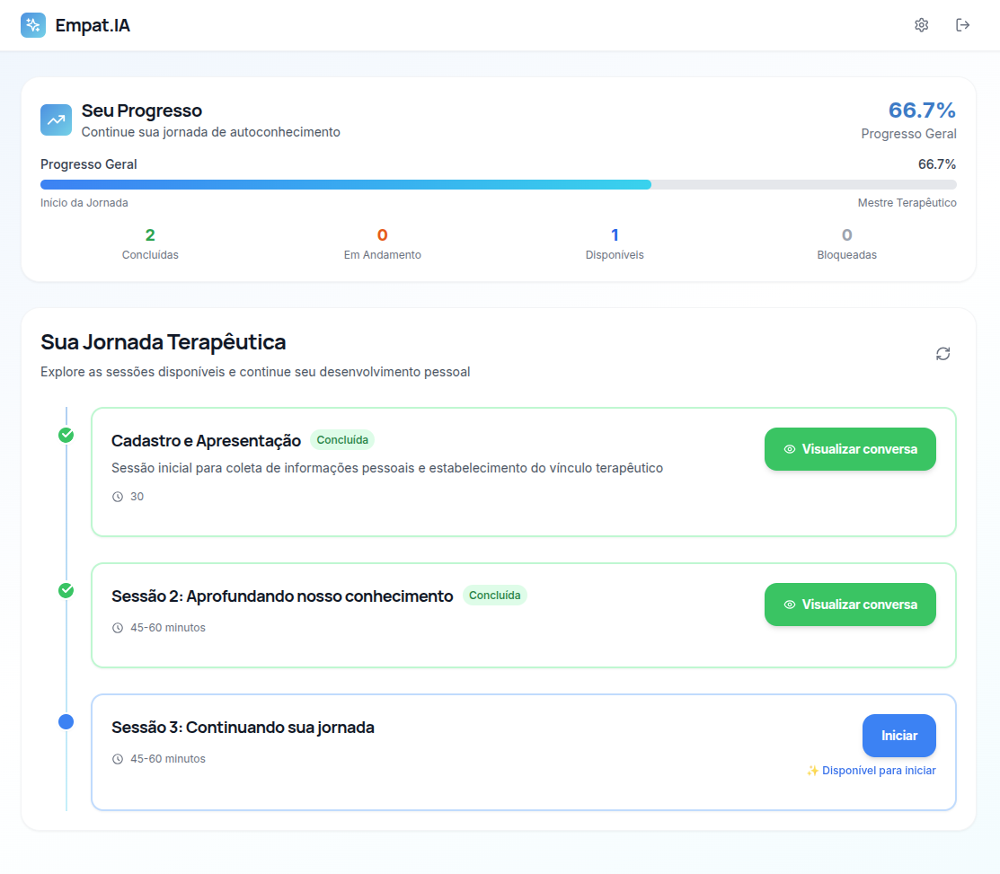
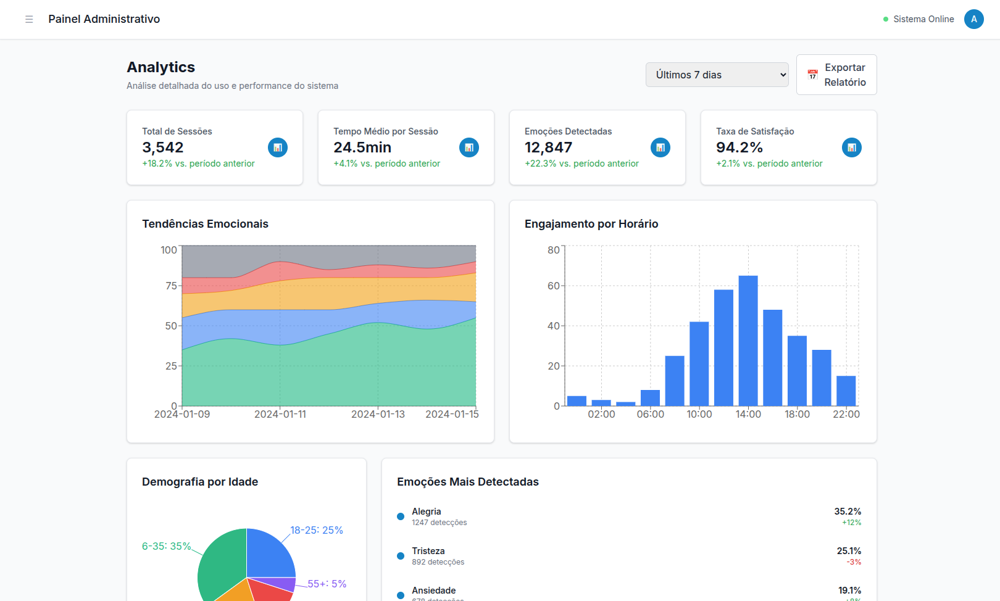
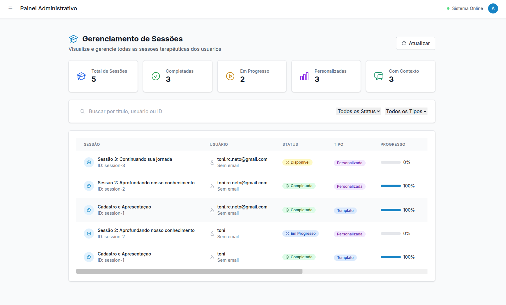
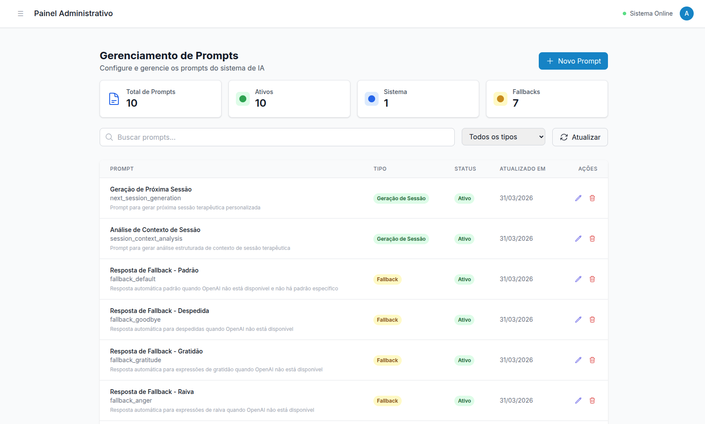
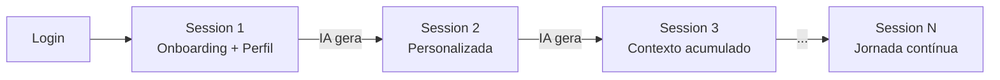

<div align="center">



# Empat.IA

### Terapia virtual inteligente, baseada na abordagem humanística de Carl Rogers

[](https://python.org)
[](https://fastapi.tiangolo.com)
[](https://react.dev)
[](https://mongodb.com)
[](https://docker.com)
[](https://cloud.google.com/kubernetes-engine)
[](LICENSE)

**[🌐 App](https://app.empat-ia.io) · [⚙️ Admin](https://admin.empat-ia.io) · [📖 API Docs](https://api.empat-ia.io/docs) · [🔧 Documentação Técnica](docs/TECHNICAL.md)**

</div>

---

## O que é o Empat.IA?

**Empat.IA** é uma plataforma de apoio terapêutico que combina IA conversacional, análise emocional em tempo real e continuidade entre sessões para criar uma experiência personalizada e progressiva — inspirada na abordagem centrada na pessoa de Carl Rogers.

> *A Empat.IA existe para **potencializar** o trabalho terapêutico, não para substituí-lo — ampliando o alcance do terapeuta com inteligência e empatia.*

---

## A Plataforma em Imagens

### Jornada do Usuário

<table>
  <tr>
    <td align="center" width="50%">
      
      <br/><b>Acesso seguro com Google OAuth</b>
      <br/><sub>Autenticação com verificação server-side do ID Token</sub>
    </td>
    <td align="center" width="50%">
      
      <br/><b>Personalização inicial — escolha da voz</b>
      <br/><sub>Vozes neurais em português brasileiro (Google Cloud TTS)</sub>
    </td>
  </tr>
  <tr>
    <td align="center" colspan="2">
      
      <br/><b>Jornada Terapêutica Personalizada</b>
      <br/><sub>Progresso visual, sessões desbloqueadas sequencialmente e geradas pela IA com base no histórico do usuário</sub>
    </td>
  </tr>
</table>

---

## Sistema de Análise Emocional

> O Empat.IA combina **detecção facial em tempo real via webcam** com **análise semântica das mensagens** para construir um perfil emocional contínuo ao longo de cada sessão. Esses dados alimentam diretamente a geração das próximas sessões e as respostas da IA — tornando cada interação mais empática e contextualizada.



**O que o sistema detecta e registra:**

| Dado | Fonte | Uso |
|------|-------|-----|
| Emoção dominante (alegria, tristeza, ansiedade…) | Webcam (DeepFace + MediaPipe) | Contexto da resposta da IA |
| Confiança da detecção (0–1) | Visão computacional | Filtragem de dados de baixa qualidade |
| Sentimento textual | Análise semântica da mensagem | Complementa a detecção facial |
| Timeline emocional completa | MongoDB (`user_emotions`) | Relatórios e geração de próxima sessão |
| Tendências ao longo do tempo | Agregação temporal | Dashboard do terapeuta |

O painel acima mostra, ao longo dos últimos 7 dias: **3.542 sessões**, **12.847 emoções detectadas**, **94.2% de taxa de satisfação** — com tendências emocionais, engajamento por horário e distribuição demográfica.

---

## Painel do Terapeuta

> O **Painel Administrativo** é onde o terapeuta tem controle total sobre a plataforma — sem precisar tocar em código. Ele define os parâmetros das sessões, edita os prompts que guiam a IA, acompanha o progresso de cada usuário e analisa os dados emocionais agregados.

### Gerenciamento de Sessões



O terapeuta visualiza em tempo real todas as sessões de todos os usuários: quais foram **concluídas**, quais estão **em progresso**, quais são **personalizadas** (geradas por IA) vs. **templates** base. Cada sessão mostra o progresso individual e pode ser gerenciada diretamente pelo painel.

### Gerenciamento de Prompts da IA



**Este é o coração da plataforma do ponto de vista clínico.** O terapeuta edita diretamente os prompts que definem como a IA se comporta em cada situação — sem redeploy, sem código:

- **Prompts de sistema** — comportamento base da IA (abordagem Rogers, tom, limites)
- **Geração de próxima sessão** — instruções para a IA criar sessões personalizadas
- **Análise de contexto** — como a IA estrutura e resume cada sessão
- **Fallbacks por emoção** — respostas automáticas para raiva, gratidão, despedida, etc.
- Cada prompt pode ser **ativado/desativado** individualmente, com versionamento e timestamps

---

## Stack & Arquitetura

```
┌─────────────────────────────────────────────────────────┐
│                     Frontend (React)                     │
│   app.empat-ia.io (Web UI)   admin.empat-ia.io (Admin)  │
└──────────────────────┬──────────────────────────────────┘
                       │ HTTPS
┌──────────────────────▼──────────────────────────────────┐
│              API Gateway (FastAPI · Porta 8000)          │
│  api.empat-ia.io — chat, auth Google+JWT, sessões       │
└──┬──────────┬──────────┬──────────┬────────────┬────────┘
   │          │          │          │            │
┌──▼──┐  ┌───▼───┐  ┌───▼───┐  ┌──▼────┐  ┌───▼────┐
│ AI  │  │ Voice │  │Emotion│  │Avatar │  │MongoDB │
│8001 │  │ 8004  │  │ 8003  │  │ 8002  │  │  +Redis│
└─────┘  └───────┘  └───────┘  └───────┘  └────────┘
OpenAI    GCloud     DeepFace     DID.ai
 GPT       TTS       MediaPipe
```

| Camada | Tecnologia |
|--------|-----------|
| **Frontend (Web UI)** | React 18, Vite, Tailwind CSS, Framer Motion, MUI |
| **Frontend (Admin)** | React 18, Vite, Tailwind CSS, Recharts, Headless UI |
| **API Gateway** | Python 3.11, FastAPI, Motor (async MongoDB), google-auth, python-jose |
| **AI Service** | Python 3.11, FastAPI, OpenAI SDK |
| **Voice Service** | Python 3.11, FastAPI, Google Cloud TTS, librosa |
| **Emotion Service** | TensorFlow 2.13 GPU, DeepFace, MediaPipe, OpenCV |
| **Banco de dados** | MongoDB 7, Redis 7 |
| **Infra** | Docker Compose (local), GKE Autopilot (produção), Terraform, GitHub Actions |

> Para detalhes técnicos completos — endpoints, schema MongoDB, variáveis de ambiente, deploy GKE e decisões de arquitetura — consulte a **[Documentação Técnica](docs/TECHNICAL.md)**.

---

## Começando

### Pré-requisitos

- **Docker** 20.10+ e **Docker Compose** 2.0+
- Chave de API **OpenAI**
- **Google OAuth Client ID** (para login — [como obter](https://console.cloud.google.com/apis/credentials))
- Credenciais **Google Cloud** (para síntese de voz — opcional)

### Instalação em 3 passos

```bash
# 1. Clone
git clone https://github.com/arangelcn/empath-ia.git && cd empath-ia

# 2. Configure
cp .env.example .env
# Edite .env — mínimo necessário: OPENAI_API_KEY e GOOGLE_CLIENT_ID

# 3. Suba
docker compose up -d
```

| URL | Serviço |
|-----|---------|
| http://localhost:7860 | Web UI (usuário) |
| http://localhost:3001 | Admin Panel (terapeuta) |
| http://localhost:8000/docs | API interativa |

### Desenvolvimento com hot reload

```bash
docker compose -f docker-compose.yml -f docker-compose.dev.yml up -d
# Mongo Express disponível em http://localhost:8081
```

---

## Configuração Mínima

```bash
# .env — campos obrigatórios
OPENAI_API_KEY=sk-...
GOOGLE_CLIENT_ID=xxxxxxx.apps.googleusercontent.com
SECRET_KEY=$(openssl rand -hex 32)   # JWT de sessão
```

Veja o `.env.example` e a [Documentação Técnica](docs/TECHNICAL.md) para todas as variáveis disponíveis.

---

## Fluxo das Sessões



Cada sessão é gerada automaticamente com base no **perfil do usuário** + **contexto da sessão anterior** + **dados emocionais coletados**.

---

## Deploy em Produção

O projeto roda em **GKE Autopilot** com deploy automático via GitHub Actions no push para `main`.

```
app.empat-ia.io    → Web UI
admin.empat-ia.io  → Admin Panel
api.empat-ia.io    → Gateway API
```

Veja detalhes de infraestrutura, Terraform e pipeline CI/CD na [Documentação Técnica](docs/TECHNICAL.md).

---

## Atualizações Recentes (Abril 2026)

- **Login Google restaurado em produção** — `GOOGLE_CLIENT_ID` adicionado ao ConfigMap do K8s; endpoint `/api/auth/google/status` deployado corretamente
- **Correção de áudio no proxy** — `audio_url` reescrita no gateway para servir MP3 via `/api/voice/audio/`
- **Pipeline CI/CD estabilizado** — HTTPS e certificados gerenciados no GKE Autopilot
- **Infra Terraform completa** — VPC, GKE, Secret Manager, DNS, Artifact Registry

---

## Contribuindo

```bash
git checkout -b feature/minha-feature
git commit -m "feat: descrição da mudança"   # Conventional Commits
# Abra um Pull Request para main
```

**Padrões:** Python — PEP 8 + Black · JS/TS — ESLint + Prettier

---

## Licença

MIT — veja [LICENSE](LICENSE).

---

## Agradecimentos

- **Carl Rogers** — pela abordagem terapêutica centrada na pessoa que inspira o projeto
- **OpenAI** — GPT para respostas terapêuticas empáticas
- **Google Cloud** — síntese de voz neural e OAuth
- **MongoDB** — persistência flexível do contexto terapêutico

---

<div align="center">

**Empat.IA** — *Inteligência artificial a serviço do bem-estar humano* 💙

[app.empat-ia.io](https://app.empat-ia.io) · [suporte@empat-ia.io](mailto:suporte@empat-ia.io)

</div>
