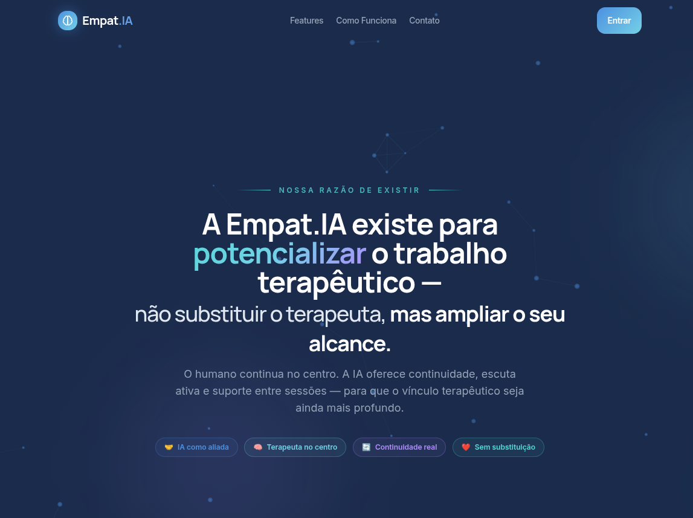
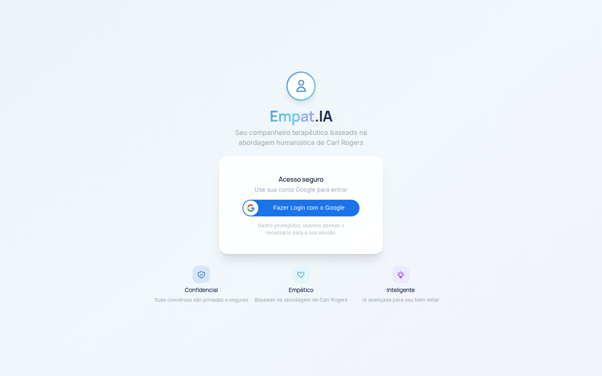
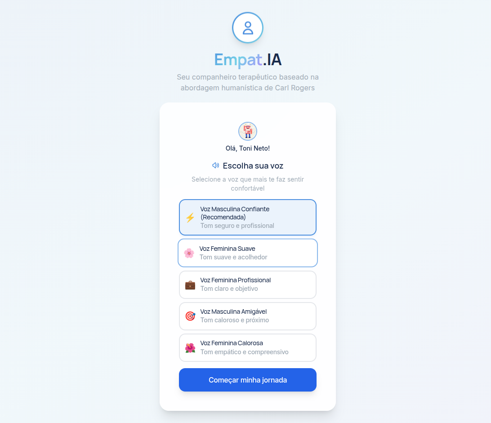
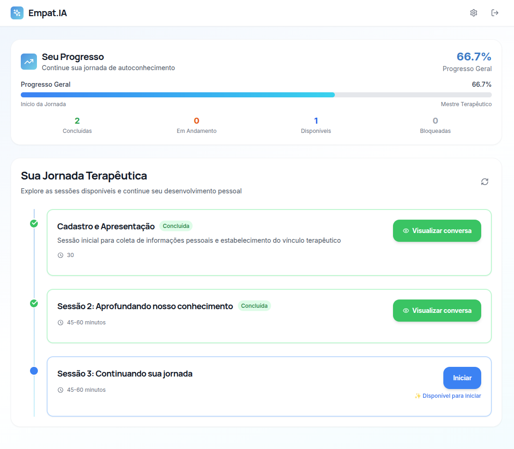
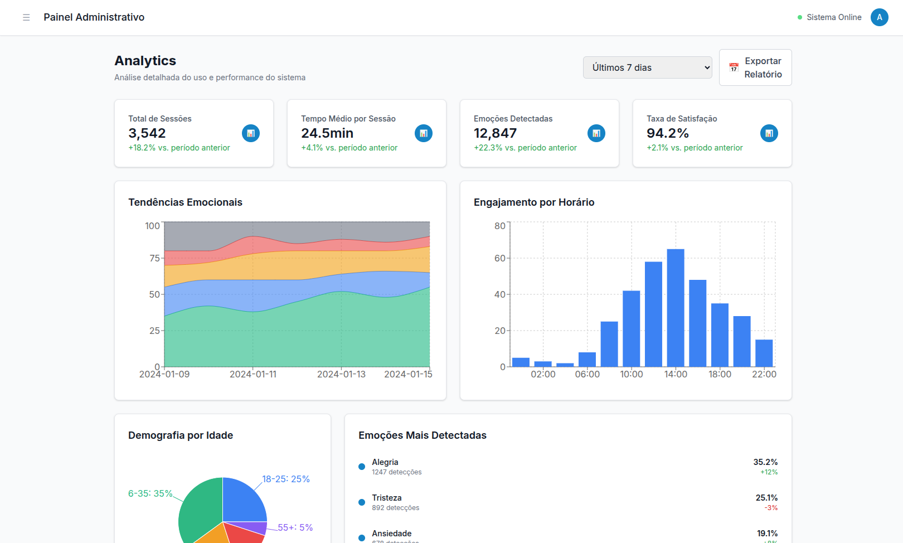
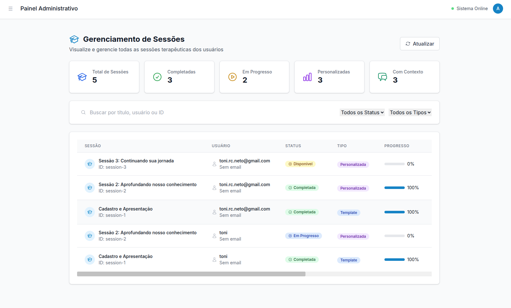
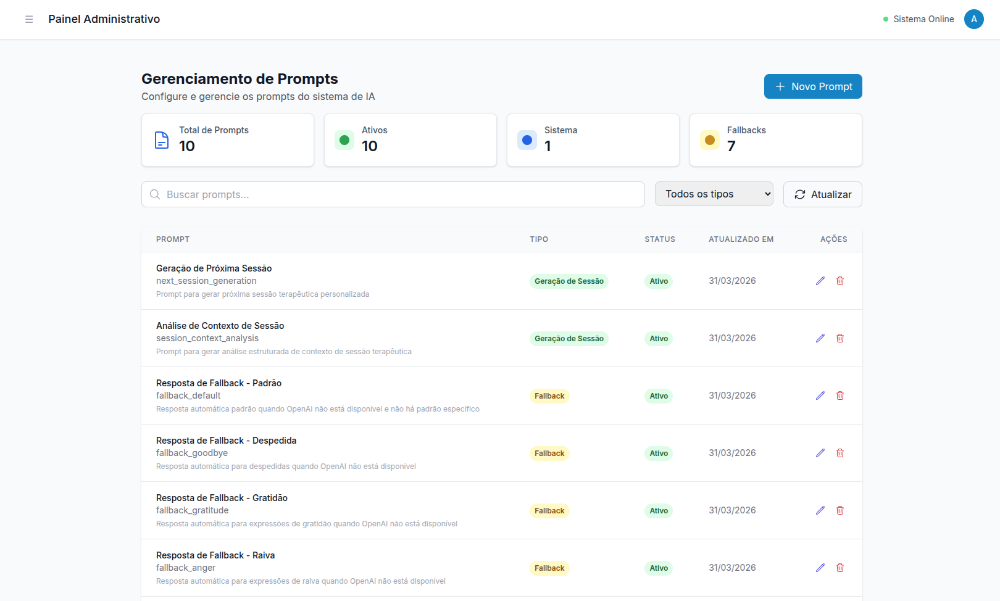
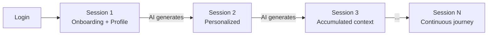

<div align="center">



# Empat.IA

### Intelligent virtual therapy inspired by Carl Rogers' humanistic approach

[](https://python.org)
[](https://fastapi.tiangolo.com)
[](https://react.dev)
[](https://mongodb.com)
[](https://docker.com)
[](https://cloud.google.com/kubernetes-engine)
[](LICENSE)

**[🌐 App](https://app.empat-ia.io) · [⚙️ Admin](https://admin.empat-ia.io) · [📖 API Docs](https://api.empat-ia.io/docs) · [🔧 Technical Docs](docs/TECHNICAL.md)**

</div>

---

## What is Empat.IA?

**Empat.IA** is a therapeutic support platform that combines conversational AI, real-time emotional analysis, and continuity across sessions to create a personalized and progressive experience inspired by Carl Rogers' person-centered approach.

> *Empat.IA exists to **enhance** therapeutic work, not replace it, by extending the therapist's reach with intelligence and empathy.*

---

## Platform Screens

### User Journey

<table>
  <tr>
    <td align="center" width="50%">
      
      <br/><b>Secure access with Google OAuth</b>
      <br/><sub>Server-side ID token verification</sub>
    </td>
    <td align="center" width="50%">
      
      <br/><b>Initial personalization - voice selection</b>
      <br/><sub>Brazilian Portuguese neural voices (Google Cloud TTS)</sub>
    </td>
  </tr>
  <tr>
    <td align="center" colspan="2">
      
      <br/><b>Personalized therapeutic journey</b>
      <br/><sub>Visual progress, sequentially unlocked sessions, and AI-generated sessions based on user history</sub>
    </td>
  </tr>
</table>

---

## Emotional Analysis System

> Empat.IA combines **real-time webcam facial detection** with **semantic text analysis** to build a continuous emotional profile during each session. These signals feed both future session generation and AI responses, making each interaction more contextual and empathetic.



**What the system detects and stores:**

| Data | Source | Usage |
|------|--------|-------|
| Dominant emotion (joy, sadness, anxiety...) | Webcam (DeepFace + MediaPipe) | AI response context |
| Detection confidence (0-1) | Computer vision | Low-quality signal filtering |
| Text sentiment | Message semantic analysis | Complements facial detection |
| Full emotional timeline | MongoDB (`user_emotions`) | Reports and next-session generation |
| Trends over time | Time aggregation | Therapist dashboard |

The screen above illustrates the emotional analytics area. In the current state, the Admin app should distinguish real data, empty states, and backend unavailability without presenting simulated metrics as production data.

---

## Therapist Admin Panel

> The **Admin Panel** gives therapists full operational control without touching code. It centralizes session parameters, AI prompt management, user progress tracking, and aggregate emotional analysis.

### Session Management



Therapists can monitor all user sessions in real time: **completed**, **in progress**, **AI-personalized**, and **base templates**. Each session includes user-level progress and can be managed directly from the panel.

### AI Prompt Management



**This is the clinical core of the platform.** Therapists can directly edit prompts that define AI behavior, with no redeploy and no code changes:

- **System prompts** - base AI behavior (Rogers approach, tone, limits)
- **Next session generation** - instructions for personalized session creation
- **Context analysis** - instructions for structuring and summarizing each session
- **Emotion-based fallbacks** - automatic responses for anger, gratitude, goodbye, etc.
- Each prompt can be **enabled/disabled** independently, with version numbers and timestamps; advanced prompt governance remains the next roadmap priority

---

## Stack and Architecture

```
┌─────────────────────────────────────────────────────────┐
│                     Frontend (React)                    │
│   app.empat-ia.io (Web UI)   admin.empat-ia.io (Admin) │
└──────────────────────┬──────────────────────────────────┘
                       │ HTTPS
┌──────────────────────▼──────────────────────────────────┐
│              API Gateway (FastAPI · Port 8000)         │
│  api.empat-ia.io - chat, Google+JWT auth, sessions     │
└──┬──────────┬──────────┬──────────┬────────────┬────────┘
   │          │          │          │            │
┌──▼──┐  ┌───▼───┐  ┌───▼───┐  ┌──▼────┐  ┌───▼────┐
│ AI  │  │ Voice │  │Emotion│  │Avatar │  │MongoDB │
│8001 │  │ 8004  │  │ 8003  │  │ 8002  │  │  +Redis│
└─────┘  └───────┘  └───────┘  └───────┘  └────────┘
OpenAI    GCloud     DeepFace     DID.ai
 GPT       TTS       MediaPipe
```

| Layer | Technology |
|------|------------|
| **Frontend (Web UI)** | React 18, Vite, Tailwind CSS, Framer Motion, MUI |
| **Frontend (Admin)** | React 18, Vite, Tailwind CSS, Recharts, Headless UI |
| **API Gateway** | Python 3.11, FastAPI, Motor (async MongoDB), google-auth, python-jose |
| **AI Service** | Python 3.11, FastAPI, OpenAI SDK |
| **Voice Service** | Python 3.11, FastAPI, Google Cloud TTS, librosa |
| **Emotion Service** | TensorFlow 2.13 GPU, DeepFace, MediaPipe, OpenCV |
| **Database** | MongoDB 7, Redis 7 |
| **Infra** | Docker Compose (local), GKE Autopilot (production), Terraform, GitHub Actions |

> For full technical details (endpoints, MongoDB schema, env vars, GKE deploy, and architecture decisions), see **[Technical Docs](docs/TECHNICAL.md)**.

---

## Getting Started

### Prerequisites

- **Docker** 20.10+ and **Docker Compose** 2.0+
- **OpenAI API key**
- **Google OAuth Client ID** (for login - [how to get it](https://console.cloud.google.com/apis/credentials))
- **Google Cloud credentials** (for voice synthesis - optional)

### 3-step setup

```bash
# 1. Clone
git clone https://github.com/arangelcn/empath-ia.git && cd empath-ia

# 2. Configure
cp .env.example .env
# Edit .env - minimum: OPENAI_API_KEY and GOOGLE_CLIENT_ID

# 3. Start
docker compose up -d
```

| URL | Service |
|-----|---------|
| http://localhost:7860 | Web UI (user) |
| http://localhost:3001 | Admin panel (therapist) |
| http://localhost:8001/docs | Interactive API |

### Development with hot reload

```bash
docker compose -f docker-compose.yml -f docker-compose.dev.yml up -d
# Mongo Express available at http://localhost:8081
```

---

## Minimum Configuration

```bash
# .env - required fields
OPENAI_API_KEY=sk-...
GOOGLE_CLIENT_ID=xxxxxxx.apps.googleusercontent.com
SECRET_KEY=$(openssl rand -hex 32)   # session JWT signing key
```

See `.env.example` and [Technical Docs](docs/TECHNICAL.md) for the full variable list.

---

## Session Flow


```mermaid
graph LR
    Login --> S1["Session 1\nOnboarding + Profile"]
    S1 -->|"AI generates"| S2["Session 2\nPersonalized"]
    S2 -->|"AI generates"| S3["Session 3\nAccumulated context"]
    S3 -->|"..."| SN["Session N\nContinuous journey"]
```

Each session is generated based on **user profile** + **previous session context** + **collected emotional data**.

---

## Immediate Roadmap

Recent cycles completed the core UX foundation and the first operational Admin hardening round:

- **Sidebar and recent sessions** - authenticated navigation with recent conversations, Home, Chat, and account.
- **Profile and voice settings** - edit display name and preferred voice without heavy settings flows.
- **Full name in onboarding** - collect full name for UI personalization and AI context.
- **Operational Admin improvements** - remove silent mocks, add explicit loading/error/empty states, and align screens with real data contracts.
- **Emotion Service stabilization** - dependency fixes, DeepFace/OpenFace updates, and better history/context integration.

Execution order was adjusted to prioritize conversational UX before complete RAG and LLMOps implementation:

- **Priority 7: Voice Service and low latency** - v1 shipped with Gateway SSE, local Gemma streaming, GCP Chirp 3 HD for real-time PCM, sentence chunking, frontend audio queue, and per-chunk batch fallback.
- **Priority 5: Prompt Control and LLMOps** - next structural phase: strict versioning, review states, audit trail, rollback, per-response traceability, and regression tests for critical prompts.
- **Priority 6: Admin-driven RAG pipeline** - intentionally deferred in this round; still pending document curation, explicit approval, embeddings, model-agnostic retrieval, citations, and grounding evaluation.

Detailed checklist: [`docs/roadmap/ROADMAP.md`](docs/roadmap/ROADMAP.md).

---

## Production Deployment

The project runs on **GKE Autopilot** with automatic GitHub Actions deployment on every push to `main`.

```
app.empat-ia.io    -> Web UI
admin.empat-ia.io  -> Admin panel
api.empat-ia.io    -> Gateway API
```

See infra, Terraform, and CI/CD pipeline details in [Technical Docs](docs/TECHNICAL.md).

---

## Recent Updates (April/May 2026)

- **Admin revised as an operational tool** - key screens now explicitly show real data, empty states, backend errors, and coverage gaps.
- **Prompt Management promoted to a core roadmap front** - prompts treated as operational assets with audit, versioning, evaluation, and rollback.
- **Emotion Service stabilized** - DeepFace/OpenFace, dependency fixes, and GPU policy adjustments to reduce runtime failures.
- **Chat session isolation hardened** - navigation and history preserve opaque user/session identifiers.
- **Onboarding and profile completed** - full name, display name, and preferred voice integrated into authenticated experience.
- **Google login restored in production** - `GOOGLE_CLIENT_ID` added to K8s ConfigMap; `/api/auth/google/status` deployed correctly.
- **Audio proxy fix** - gateway rewrites `audio_url` to serve MP3 through `/api/voice/audio/`.
- **CI/CD stabilized** - managed HTTPS and certificates on GKE Autopilot.
- **Terraform infra completed** - VPC, GKE, Secret Manager, DNS, and Artifact Registry.

---

## Contributing

```bash
git checkout -b feature/my-feature
git commit -m "feat: change description"   # Conventional Commits
# Open a Pull Request to main
```

**Standards:** Python - PEP 8 + Black · JS/TS - ESLint + Prettier

---

## License

MIT - see [LICENSE](LICENSE).

---

## Acknowledgements

- **Carl Rogers** - person-centered therapeutic approach that inspires this project
- **OpenAI** - GPT for empathetic therapeutic responses
- **Google Cloud** - neural voice synthesis and OAuth
- **MongoDB** - flexible therapeutic context persistence

---

<div align="center">

**Empat.IA** - *Artificial intelligence in service of human wellbeing*

[app.empat-ia.io](https://app.empat-ia.io) · [support@empat-ia.io](mailto:support@empat-ia.io)

</div>
