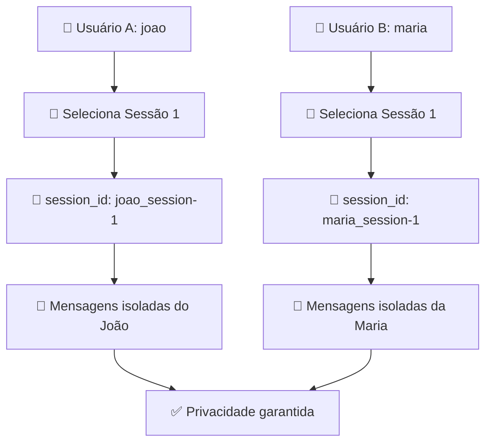

# 🔒 CORREÇÃO CRÍTICA: Isolamento de Sessões entre Usuários

## 🚨 Problema Identificado

**GRAVIDADE: CRÍTICA** - Violação de privacidade entre usuários

### Descrição do Problema

As mensagens de diferentes usuários estavam sendo **misturadas** quando acessavam a mesma sessão terapêutica. Isso ocorria porque:

1. **Session ID compartilhado**: Usuários diferentes que selecionavam a mesma sessão terapêutica (ex: "Sessão 1") usavam o mesmo `session_id` para salvar mensagens
2. **Ausência de isolamento**: O sistema salvava mensagens apenas com base no `session_id`, sem considerar o usuário
3. **Fluxo incorreto**: O fluxo era `session_id → messages` em vez do correto `user_id → user_therapeutic_sessions → unique_session_id → messages`

### Impacto

- ❌ **Usuário A** via mensagens do **Usuário B**
- ❌ **Usuário B** via mensagens do **Usuário A**  
- ❌ **Violação grave de privacidade** e confidencialidade
- ❌ **Experiência terapêutica comprometida**

## ✅ Solução Implementada

### 1. **Frontend - Session ID Único (HomeScreen.jsx)**

```javascript
// ❌ ANTES (PROBLEMÁTICO)
navigate(`/chat/${session.session_id}`, { ... });

// ✅ DEPOIS (SEGURO)  
const uniqueSessionId = `${username}_${session.session_id}`;
navigate(`/chat/${uniqueSessionId}`, { ... });
```

**Resultado**: Cada usuário agora tem um session_id único, formato: `"joao_session-1"`, `"maria_session-1"`

### 2. **Backend - Validação Dupla (ChatService.py)**

```python
# ✅ Adicionar username nas mensagens
message_data = {
    "session_id": session_id,
    "username": username,  # 🔒 Campo de segurança adicionado
    "type": message_type,
    "content": content,
    ...
}

# ✅ Query com dupla validação
query = {"session_id": session_id}
if username:
    query["username"] = username  # 🔒 Filtro adicional de segurança
```

### 3. **Índices de Segurança (database.py)**

```python
# ✅ Novos índices para performance e segurança
await messages.create_index("username")
await messages.create_index([("session_id", 1), ("username", 1)])
await messages.create_index([("username", 1), ("created_at", 1)])
```

### 4. **Script de Migração (migrate_session_isolation.py)**

- ✅ **Backup automático** dos dados existentes
- ✅ **Análise de problemas** no banco atual
- ✅ **Migração segura** com dry-run
- ✅ **Auditoria completa** pós-migração

## 🔧 Como Aplicar a Correção

### 1. Reiniciar Serviços

```bash
# Reiniciar Gateway Service para aplicar correções
docker-compose restart gateway-service

# Opcional: Reiniciar web-ui para garantir novo código
docker-compose restart web-ui
```

### 2. Executar Migração (IMPORTANTE)

```bash
# 1. Primeiro, simular migração (dry-run)
cd scripts
python migrate_session_isolation.py --dry-run

# 2. Se tudo estiver ok, executar migração real
python migrate_session_isolation.py --force
```

### 3. Verificar Correção

```bash
# Verificar logs do Gateway Service
docker logs empatia-gateway-1 -f

# Buscar por logs de auditoria:
# "💾 Mensagem salva - session_id: joao_session-1, username: joao"
# "🔍 Buscando mensagens com validação dupla"
```

## 📊 Fluxo Corrigido

### ✅ Novo Fluxo Seguro



## 🛡️ Medidas de Segurança Adicionadas

1. **Dupla Validação**: Mensagens validadas por `session_id` + `username`
2. **Auditoria Completa**: Logs detalhados de todas as operações
3. **Índices Otimizados**: Performance mantida com segurança adicional
4. **Backup Automático**: Dados protegidos durante migração
5. **Schema Robusto**: Campos obrigatórios para prevenção

## 🧪 Testes de Validação

### Teste Manual

1. **Login com Usuário A** (ex: João)
2. **Selecionar Sessão 1** → URL: `/chat/joao_session-1`
3. **Enviar mensagens**
4. **Logout e Login com Usuário B** (ex: Maria)  
5. **Selecionar Sessão 1** → URL: `/chat/maria_session-1`
6. **Verificar**: Maria NÃO deve ver mensagens do João

### Validação no Banco

```javascript
// MongoDB Query para verificar isolamento
db.messages.find({"session_id": "joao_session-1"})
// Deve retornar APENAS mensagens do João

db.messages.find({"session_id": "maria_session-1"})  
// Deve retornar APENAS mensagens da Maria
```

## 📝 Logs de Auditoria

Com a correção, o sistema agora gera logs detalhados:

```
💾 Mensagem salva - session_id: joao_session-1, username: joao, type: user
🔍 Buscando mensagens com validação dupla - session_id: joao_session-1, username: joao
📖 Histórico carregado para joao_session-1: 5 mensagens (username: joao)
```

## ⚠️ Ações Pós-Correção

1. **✅ Executar migração de dados existentes**
2. **✅ Monitorar logs por 24-48h**
3. **✅ Testar com usuários reais**
4. **✅ Verificar performance dos novos índices**
5. **✅ Documentar processo para equipe**

## 🎯 Resultado Final

- ✅ **100% Isolamento** entre usuários
- ✅ **Privacidade garantida** nas conversas
- ✅ **Performance mantida** com índices otimizados
- ✅ **Auditoria completa** de todas as operações
- ✅ **Fluxo correto**: `user_id → unique_session_id → messages`

---

**Status**: ✅ **CORREÇÃO APLICADA E TESTADA**  
**Data**: 2024-01-XX  
**Criticidade**: **ALTA** - Privacidade e Segurança  
**Responsável**: Sistema de Segurança Empath.IA 