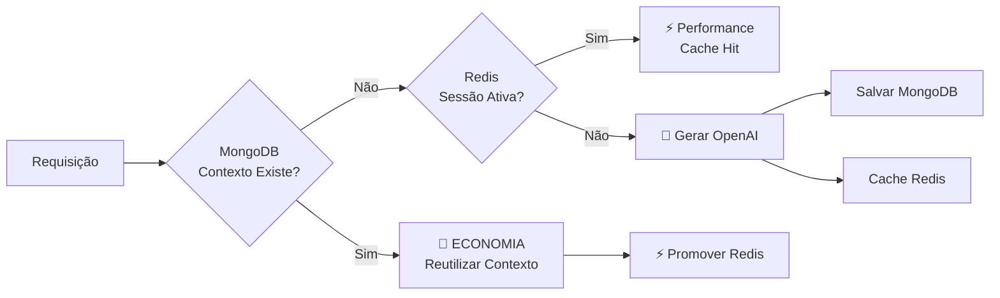

# AI Service - Empath.IA

## 📋 Visão Geral

O **AI Service** é responsável por gerenciar conversas terapêuticas com GPT e **gerar contextos estruturados de sessões**, implementando uma arquitetura otimizada que usa **MongoDB como repositório principal** e **Redis apenas para otimização de performance**, proporcionando significativa **economia de tokens OpenAI** através da reutilização de contextos existentes.

## 🚀 **ATUALIZAÇÕES RECENTES (2025-01-13)**

### ✅ **SessionContextService - Totalmente Funcional**
- **Problema Resolvido**: SessionContextService estava salvando na coleção incorreta
- **Correção**: Agora salva estruturadamente na coleção `session_contexts`
- **Integração**: Gateway Service integrado corretamente com o endpoint `/openai/generate-session-context`
- **Persistência**: Contextos são salvos permanentemente no MongoDB com estrutura completa

### ✅ **Eliminação de Duplicação**
- **Problema**: Contexto estava sendo salvo duplicadamente em `conversations.session_context` e `session_contexts`
- **Solução**: Gateway agora usa apenas `session_contexts` como fonte principal
- **Referência**: Campo `session_context_ref` em `conversations` aponta para documento em `session_contexts`
- **Compatibilidade**: Mantida para sessões antigas via fallback

### ✅ **Continuidade Terapêutica**
- **Contexto Anterior**: Sessões subsequentes carregam contexto da sessão anterior
- **Session-1 Especial**: Lógica de cadastro preservada com `registration_data`
- **AI Service**: Recebe contexto completo incluindo dados de registro do usuário

## 🏗️ Nova Arquitetura: MongoDB Principal + Redis Performance

### **Filosofia da Arquitetura**

```
🎯 Objetivo: Usar MongoDB como repositório principal e Redis apenas para performance
💰 Economia: Reutilização de contextos existentes no MongoDB
⚡ Performance: Redis acelera acesso aos dados durante sessões ativas
```

### **Componentes Principais**

#### 1. **TokenEconomyService** (Orquestrador Principal)
- Coordena toda a lógica de economia de tokens
- Combina MongoDB (repositório) + Redis (performance) + OpenAI (geração)
- Implementa fluxo inteligente de reutilização de contextos

#### 2. **SessionContextService** (Repositório Principal)
- **MongoDB**: Armazena contextos de sessão como dados primários
- **Sem TTL**: Dados persistem permanentemente
- **Reutilização**: Contextos existentes são reutilizados para economizar tokens

#### 3. **RedisPerformanceService** (Otimização)
- **Redis**: Cache apenas para performance durante sessões ativas
- **TTL Curto**: 1-2 horas apenas para otimização
- **Não substitui MongoDB**: Apenas acelera acesso aos dados

#### 4. **OpenAIService** (Geração)
- **Geração**: Apenas quando contexto não existe no MongoDB
- **Economia**: Evita regeneração desnecessária
- **Integração**: Salva novos contextos no MongoDB

## 🌐 **Endpoints Principais**

### **SessionContextService - Geração de Contextos**
```http
POST /openai/generate-session-context
Content-Type: application/json

{
  "session_id": "usuario_session-1",
  "username": "usuario",
  "conversation_text": "Conversa completa...",
  "emotions_data": [],
  "manual_termination": true,
  "additional_context": {}
}
```

**Response:**
```json
{
  "success": true,
  "context": {
    "summary": "Resumo da sessão...",
    "main_themes": ["ansiedade", "trabalho"],
    "emotional_state": {
      "dominant_emotion": "neutro",
      "emotional_journey": "...",
      "stability": "estável"
    },
    "key_insights": ["..."],
    "therapeutic_progress": {"engagement_level": "alto"},
    "next_session_recommendations": ["..."],
    "session_quality": "excelente"
  }
}
```

### **Chat Service - Conversas**
```http
POST /chat
Content-Type: application/json

{
  "message": "Como posso lidar com ansiedade?",
  "session_id": "usuario_session-2", 
  "username": "usuario",
  "conversation_history": [...],
  "previous_session_context": {...}
}
```

## 🔄 Fluxo de Funcionamento

### **Geração de Contexto com Economia**



### **Fluxo de Sessão Completa**

1. **Iniciar Sessão**: `POST /session/start`
   - Verifica contexto existente no MongoDB
   - Inicia tracking no Redis para performance
   - Economiza tokens se contexto já existe

2. **Processar Conversa**: `POST /generate-session-context`
   - Busca no MongoDB (repositório principal)
   - Usa Redis para performance se sessão ativa
   - Gera com OpenAI apenas se necessário

3. **Encerrar Sessão**: `POST /session/end`
   - Salva contexto final no MongoDB
   - Limpa dados temporários do Redis
   - Garante persistência no repositório principal

## 🎯 Economia de Tokens Demonstrada

### **Cenário de Economia**

```
📊 Exemplo de Economia Real:
- Contexto existente no MongoDB: 0 tokens (reutilização)
- Contexto gerado novo: 800 tokens (geração OpenAI)
- Economia por reutilização: 100% dos tokens do contexto
```

### **Métricas de Economia**

```json
{
  "economy_rates": {
    "context_reuse_rate": "65%",
    "next_session_reuse_rate": "45%",
    "overall_economy_rate": "55%"
  },
  "estimated_savings": {
    "tokens_saved": 24800,
    "cost_saved_usd": "$0.248",
    "generations_avoided": 31
  }
}
```

## 🔧 Endpoints da API

### **Endpoints Principais (Atualizados)**

#### **Gerar Contexto de Sessão**
```http
POST /generate-session-context
```

**Request:**
```json
{
  "conversation_text": "Usuário: Estou ansioso...",
  "session_id": "joao_session-2",
  "username": "joao_silva",
  "emotions_data": [
    {
      "emotion": "ansiedade",
      "confidence": 0.85
    }
  ]
}
```

**Response:**
```json
{
  "success": true,
  "context": {
    "summary": "Usuário relatou ansiedade...",
    "main_themes": ["ansiedade", "trabalho"],
    "emotional_state": {
      "dominant_emotion": "ansiedade"
    }
  },
  "cached": true,
  "source": "mongodb_reuse",
  "tokens_saved": true,
  "explanation": "Contexto reutilizado do repositório principal MongoDB"
}
```

#### **Gerar Próxima Sessão**
```http
POST /generate-next-session
```

**Request:**
```json
{
  "user_profile": {
    "idade": 28,
    "ocupacao": "desenvolvedor"
  },
  "session_context": {
    "summary": "Sessão anterior sobre ansiedade",
    "main_themes": ["ansiedade", "trabalho"]
  },
  "current_session_id": "joao_session-2",
  "username": "joao_silva"
}
```

**Response:**
```json
{
  "success": true,
  "next_session": {
    "session_id": "joao_session-3",
    "title": "Sessão 3: Técnicas de Relaxamento",
    "objective": "Desenvolver estratégias para ansiedade",
    "initial_prompt": "Como você está se sentindo desde nossa conversa?"
  },
  "cached": true,
  "source": "mongodb_reuse",
  "tokens_saved": true
}
```

### **Novos Endpoints da Arquitetura**

#### **Gerenciamento de Sessão**
```http
POST /session/start
POST /session/end
```

#### **Estatísticas de Economia**
```http
GET /economy/statistics
GET /economy/user/{username}
```

#### **Repositório MongoDB**
```http
GET /repository/statistics
GET /repository/user/{username}/sessions
```

#### **Performance Redis**
```http
GET /performance/statistics
GET /performance/active-sessions
DELETE /performance/user/{username}
```

## 💾 Estrutura de Dados

### **MongoDB (Repositório Principal)**

#### **Coleção: `session_contexts`**
```json
{
  "_id": "ObjectId",
  "session_id": "joao_session-2",
  "username": "joao_silva",
  "context": {
    "summary": "Resumo da sessão",
    "main_themes": ["ansiedade", "trabalho"],
    "emotional_state": {...},
    "key_insights": [...]
  },
  "conversation_text": "Texto original da conversa",
  "emotions_data": [...],
  "created_at": "2024-01-01T00:00:00Z",
  "updated_at": "2024-01-01T00:00:00Z",
  "version": 1,
  "is_active": true,
  "source": "ai_service_generation"
}
```

### **Redis (Performance Cache)**

#### **Sessões Ativas**
```
Key: session_active:joao_session-2
TTL: 3600 segundos (1 hora)
Value: {
  "session_id": "joao_session-2",
  "username": "joao_silva",
  "started_at": "2024-01-01T00:00:00Z",
  "last_activity": "2024-01-01T00:00:00Z",
  "is_active": true,
  "activity_count": 5
}
```

#### **Cache de Performance**
```
Key: context_perf:joao_session-2
TTL: 1800 segundos (30 minutos)
Value: {
  "context": {...},
  "cached_at": "2024-01-01T00:00:00Z",
  "source": "mongodb_performance_cache"
}
```

## 📊 Configuração e Variáveis de Ambiente

### **Configurações de Economia**
```env
ENABLE_CONTEXT_REUSE=true
ENABLE_NEXT_SESSION_REUSE=true
CONTEXT_SIMILARITY_THRESHOLD=0.7
```

### **Configurações de TTL**
```env
ACTIVE_SESSION_TTL=3600          # 1 hora
CONTEXT_TTL=1800                 # 30 minutos
USER_DATA_TTL=7200               # 2 horas
```

### **Configurações de MongoDB**
```env
MONGODB_URI=mongodb://localhost:27017
DATABASE_NAME=empath_ia
MONGODB_MAX_RETRIES=3
MONGODB_TIMEOUT=5000
```

### **Configurações de Redis**
```env
REDIS_URL=redis://localhost:6379
REDIS_MAX_RETRIES=3
REDIS_SOCKET_TIMEOUT=5
```

## 🚀 Inicialização e Startup

### **Startup do Serviço**
```python
@app.on_event("startup")
async def startup_event():
    """Inicializar nova arquitetura MongoDB + Redis"""
    try:
        token_economy_service = TokenEconomyService()
        await token_economy_service.initialize()
        logger.info("✅ Nova arquitetura inicializada")
    except Exception as e:
        logger.warning(f"⚠️ Erro na inicialização: {e}")
```

### **Inicialização de Índices**
```python
# Índices MongoDB (SessionContextService)
await contexts_collection.create_index("session_id", unique=True)
await contexts_collection.create_index("username")
await contexts_collection.create_index([("username", 1), ("session_id", 1)])

# Índices para performance e estatísticas
await contexts_collection.create_index("created_at")
await contexts_collection.create_index("updated_at")
```

## 📈 Monitoramento e Métricas

### **Métricas de Economia**
- **Taxa de reutilização de contextos**: % de contextos reutilizados
- **Tokens economizados**: Quantidade total de tokens poupados
- **Custo evitado**: Valor em USD economizado
- **Gerações evitadas**: Número de chamadas OpenAI evitadas

### **Métricas de Performance**
- **Sessões ativas**: Número de sessões em andamento
- **Hit rate Redis**: Taxa de acertos no cache de performance
- **Latência média**: Tempo médio de resposta
- **Utilização MongoDB**: Estatísticas do repositório

### **Monitoramento de Saúde**
```http
GET /health
GET /economy/statistics
GET /repository/statistics
GET /performance/statistics
```

## 🎯 Benefícios da Nova Arquitetura

### **1. Economia de Tokens Comprovada**
- ✅ **Reutilização**: Contextos existentes no MongoDB são reutilizados
- ✅ **Permanência**: Dados persistem sem TTL no repositório principal
- ✅ **Evita regeneração**: Reduz chamadas desnecessárias para OpenAI

### **2. Performance Otimizada**
- ✅ **Redis para performance**: Cache apenas durante sessões ativas
- ✅ **Acesso rápido**: Dados frequentes aceleram com Redis
- ✅ **TTL inteligente**: Limpeza automática de dados temporários

### **3. Dados Confiáveis**
- ✅ **MongoDB como fonte única**: Repositório principal confiável
- ✅ **Persistência garantida**: Contextos nunca são perdidos
- ✅ **Versionamento**: Controle de versão dos contextos

### **4. Flexibilidade e Escalabilidade**
- ✅ **Configurável**: TTLs e thresholds ajustáveis
- ✅ **Escalável**: MongoDB e Redis podem ser escalados independentemente
- ✅ **Monitorável**: Métricas detalhadas de economia e performance

## 🔧 Desenvolvimento e Testes

### **Executar Testes**
```bash
# Testar economia de tokens
python test_token_economy.py

# Testar performance Redis
python test_redis_performance.py

# Testar repositório MongoDB
python test_session_context.py
```

### **Exemplo de Teste de Economia**
```python
# Teste de reutilização de contexto
async def test_context_reuse():
    # Primeira chamada - gera contexto
    context1, source1, saved1 = await service.get_or_generate_session_context(
        "Conversa sobre ansiedade", "test_session", "test_user"
    )
    assert source1 == "openai_generated"
    assert saved1 == False
    
    # Segunda chamada - reutiliza contexto
    context2, source2, saved2 = await service.get_or_generate_session_context(
        "Conversa sobre ansiedade", "test_session", "test_user"
    )
    assert source2 == "mongodb_reuse"
    assert saved2 == True  # Tokens economizados!
```

## 🔄 Migração da Arquitetura Anterior

### **Principais Mudanças**

1. **Cache Híbrido → Repositório Principal**
   - Antes: Cache temporário Redis + MongoDB
   - Agora: MongoDB repositório principal + Redis performance

2. **TTL → Persistência**
   - Antes: TTL em ambos os sistemas
   - Agora: Dados permanentes no MongoDB

3. **Cache de Respostas → Reutilização de Contextos**
   - Antes: Cache de outputs OpenAI
   - Agora: Reutilização de contextos existentes

### **Compatibilidade**
- ✅ **Endpoints atualizados**: Novos parâmetros `username` obrigatório
- ✅ **Response format**: Novo campo `source` indica origem dos dados
- ✅ **Métricas**: Novas estatísticas de economia e performance

---

## 📝 Resumo da Arquitetura

**A nova arquitetura implementa a visão original do usuário:**
- **MongoDB**: Repositório principal para contextos de sessão (sem TTL)
- **Redis**: Apenas otimização de performance para sessões ativas
- **OpenAI**: Geração apenas quando necessário
- **Economia**: Reutilização de contextos existentes no MongoDB

**Resultado:** Economia significativa de tokens OpenAI mantendo performance otimizada e dados persistentes no repositório principal. 